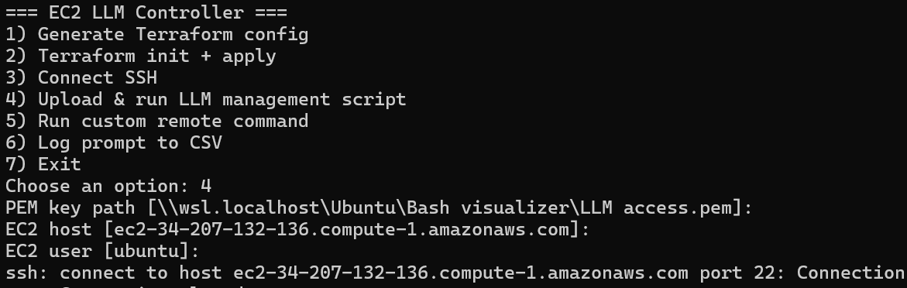

# 🚀 Bash Controller — EC2 + LLM CLI Manager

A Python-based CLI tool designed to manage AWS EC2 instances, automate infrastructure with Terraform, and control LLM workflows remotely via SSH.

---

## 📌 Overview

This project provides a lightweight DevOps-style interface that allows you to:

* Provision EC2 instances using Terraform
* Connect and execute remote scripts via SSH
* Manage and monitor an LLM (Ollama) running on EC2
* Log user prompts for tracking and analysis

---

## ⚙️ Features

### 🖥️ EC2 & Terraform Automation

* Generates Terraform configuration (`main.tf`)
* Initializes and applies infrastructure automatically
* Outputs EC2 public IP for connection

---

### 🔐 SSH Remote Control

* Connects to EC2 using SSH
* Executes remote bash scripts
* Automates LLM startup and monitoring

---

### 🤖 LLM Lifecycle Management

* Starts Ollama server remotely
* Checks CPU usage
* Verifies logs (`/home/ubuntu/ollama.log`)
* Ensures the model is running properly

---

### 📊 CSV Logging

* Collects user prompts
* Generates timestamped CSV files
* Tracks usage for future analysis

---

### 🧰 CLI Interface

* Menu-driven interface
* Modular Python structure
* Supports multi-terminal execution

---

## 📁 Project Structure

```
Bash-controller/
│
├── cli/                # CLI interface logic
├── scripts/            # Bash scripts for EC2 execution
├── terraform/          # Terraform configs
├── utils/              # Helper functions
├── main.py             # Entry point
├── requirements.txt
└── .gitignore
```

---

## 🚀 Getting Started

### 1. Clone the repository

```bash
git clone git@github.com:IanCst/Bash-controller.git
cd Bash-controller
```

---

### 2. Install dependencies

```bash
pip install -r requirements.txt
```

---

### 3. Run the CLI

```bash
python main.py
```

---

## 🔧 Example Use Cases

* Spin up an EC2 instance for LLM inference
* Automatically start and monitor Ollama
* Execute remote scripts without manual SSH
* Track prompt usage for experimentation

---

## ⚠️ Security Notes

* Never commit `.pem` files or API tokens
* Use environment variables for sensitive data
* Prefer SSH authentication over HTTPS

---

## 🧠 Future Improvements

* Add RAG pipeline integration
* Integrate with Django API
* Add real-time monitoring dashboard
* Support multiple EC2 instances

---

## 📸 Demo



---

## 📜 License

MIT License

---

## 👨‍💻 Author

Ian Lima
Building tools for AI + Cloud automation 🚀
